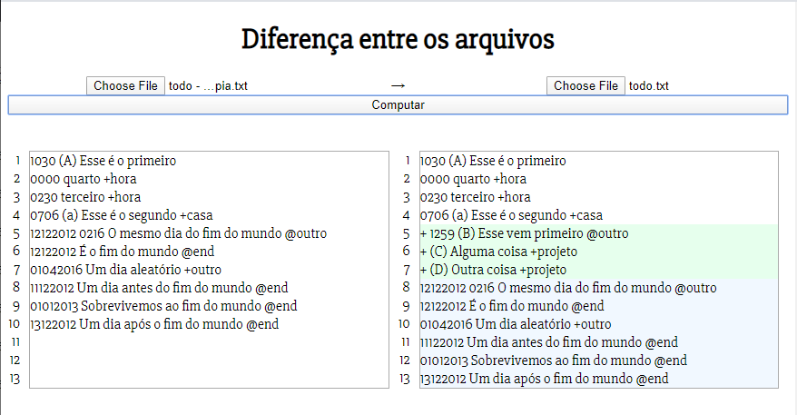
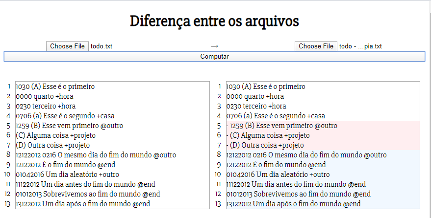
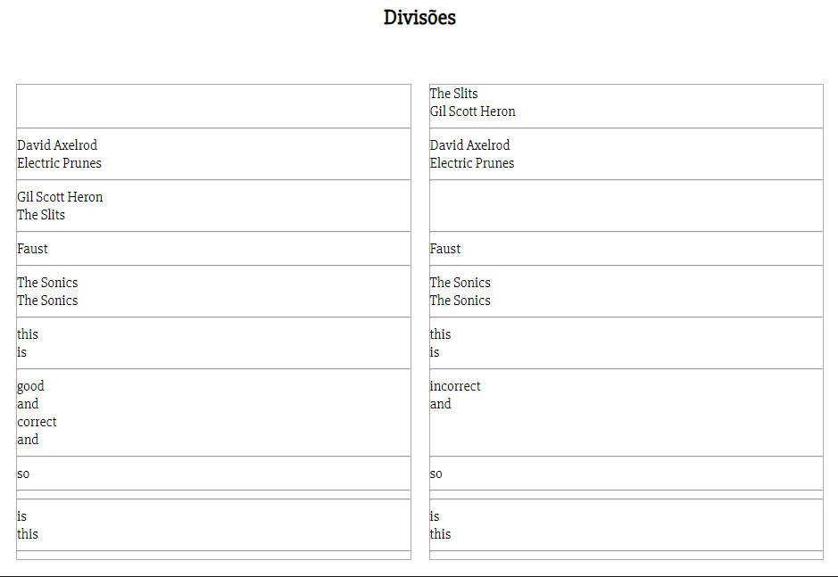
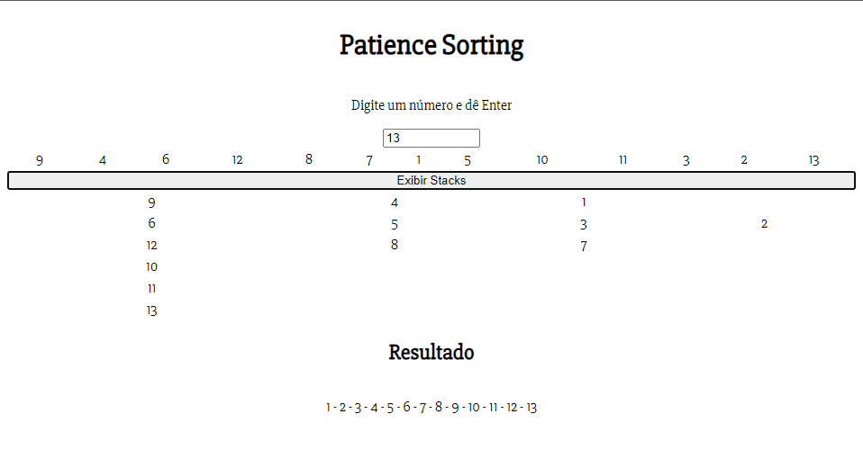

# Longest Common Subsequence for Diff

>> Feito para tentar fazer o diff do Git usando um algorítmo simples como o LCS

<p align=center>
    
    
    <br>
    
    
    
</p>



## Tecnologias usadas

- [Python](https://www.python.org/)
- HTML/CSS/JS
- [Eel](https://github.com/samuelhwilliams/Eel)
- [Brython](http://brython.info/)

## Como instalar

Certifique-se de ter o Python instalado, normalmente ele já vem com o pip, então vá no diretório raiz do projeto, e faça o comando:

``` shell
$ pip install -r requirements.txt
```

Só então rode o [server.py](./server.py), lembrando que defini como padrão o Chrome como navegador, qualquer coisa modifique o arquivo [server.py](./server.py), caso estiver usando Edge ou Firefox.

## Usando Eel

A explicação de como foi usar o Eel e como o algorítmo funciona está no index.html



## Usando Brython para o Patience Diff

O HTML de todas as páginas dentro da pasta do Brython, foi feito usando o brython, também todos os scripts e apesar delas compartilharem o CSS da página com Eel, também foi modificado alguns estilos usando Brython.

O patience diff separa o em várias partes localizando as partes que são realmente diferentes, e dessa forma rodar o diff script só com essas partes relevantes. Ao rodar o patience diff, você verá as divisões dessa forma:



## Patience Sort

No processo de escolher as divisões, as vezes vão existir várias possibilidades, dessa forma é necessário se obter do Longest increasing subsequence e apesar de ter várias formas de se obter o LIS, foi escolhido através do Patience sort. Na página de Sort, você poderá ver como funciona as stacks que ele forma.

>> Assim como a ordenação de cartas no Solitarie

O patience sort percorre a lista de números criando stacks do maior para o menor, se aparecer um número maior que o topo da stack, então outra é formada, <b> onde será guardado neste item do novo stack o valor do item do topo da stack anterior</b>. E para se obter o LIS é só pegar o último elemento, e seguir o valor guardado em cada elemento até chegar na primeira stack.


Para juntar tudo e ordenar, existem várias formas. Eu fiz duas formas, que estão no [patience.py](./web/brython/scripts/patience.py), uma que eu chamei de sortMerge, junta as stacks de forma inteligente, já que estão quase ordenados. A outra forma, que eu chamei de sortMin, percorre o topo das stacks várias vezes pegando o menor elemento, pois no topo estão os menores elementos de cada stack.

Fontes importantes:
  - [Youtube - How to Create File Diff Tool Using Longest Common Sub-Sequece Algorithm? | E1 - AM; YourMove](https://www.youtube.com/watch?v=KuHaX3_Fn8g)
  - [Blog - The Patience Diff Algorithm - Jcoglan.com by James Coglan](https://blog.jcoglan.com/2017/09/19/the-patience-diff-algorithm/)